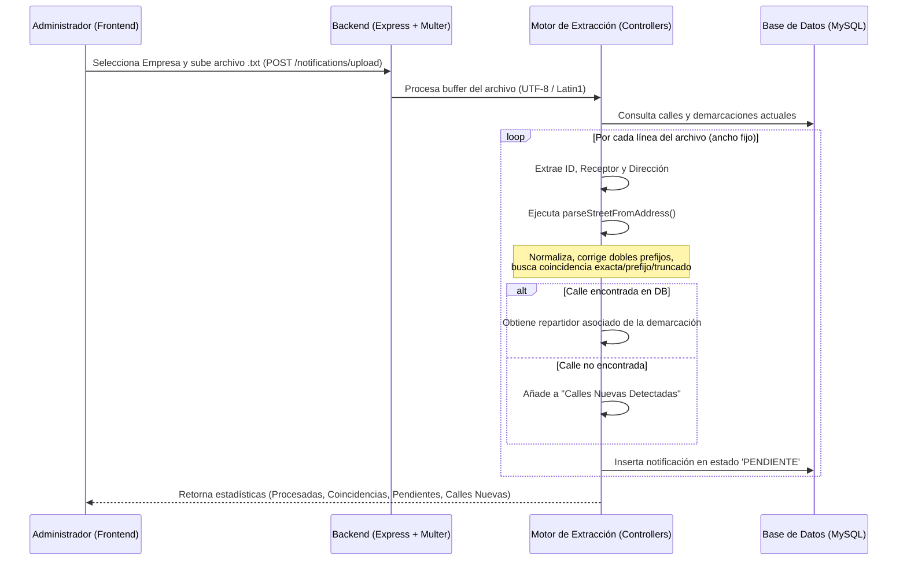

# Guía de Implementación en Producción - Trinitas

Esta guía detalla los pasos necesarios para desplegar los últimos cambios, incluyendo la unificación global de IDs y las mejoras en exportación PDF.

## ⚠️ IMPORTANTE: Backup previo
Antes de realizar cualquier cambio en producción, realiza un backup de la base de datos actual:
```bash
mysqldump -u [usuario] -p [base_de_datos] > backup_antes_migracion.sql
```

## Pasos para el Despliegue

### 1. Actualizar Código
En el servidor de producción, sitúate en la carpeta del proyecto y descarga los cambios:
```bash
git pull origin main
```

### 2. Preparar Base de Datos (Añadir columna empresa)
Es posible que falte la columna `company` en algunas tablas. Ejecuta este script primero:
```bash
node migrate_company.js
```

### 3. Migración de Base de Datos (Unificar IDs)
Ahora ejecuta el script para hacer que los IDs de notificación sean únicos a nivel global:
```bash
node make_id_unique.js
```
*Este script limpiará duplicados y ajustará las claves primarias.*

### 4. Migración de Base de Datos (Roles y Permisos)
Ejecuta el script para migrar la columna `role` de los usuarios y crear la tabla `user_permissions`:
```bash
node migrate_roles_permissions.js
```

### 5. Migración de Base de Datos (Añadir columna para archivar)
Ejecuta el script para añadir la columna `is_archived` a la tabla `notifications`:
```bash
node add_is_archived_column.js
```

### 6. Instalación de Dependencias
Asegúrate de tener todas las dependencias actualizadas:
```bash
# En la carpeta backend
npm install

# En la carpeta frontend
npm install
```

### 7. Compilación del Frontend
Genera el nuevo bundle del frontend para producción:
```bash
# En la carpeta frontend
npm run build
```

### 8. Reiniciar Servicios
Reinicia el backend para que cargue el nuevo middleware de seguridad y los nuevos controladores:
```bash
# Si usas PM2
pm2 restart all


# O reinicia el proceso de Node que tengas configurado
```


## Resumen de cambios implementados
- **ID Único Global**: Ya no hay conflictos entre empresas con el mismo ID.
- **Exportación Masiva PDF**: Nuevo botón en el listado que genera un PDF con resumen + acuses individuales.
- **Filtro "Gestionados"**: Opción para ocultar notificaciones pendientes en el listado.
- **Seguridad PDF**: Los enlaces a PDFs ahora incluyen el token de autenticación para evitar errores de acceso.
- **Correcciones UI**: Autocompletado del nombre del receptor y botón de limpieza en la app del repartidor.

---

# Análisis del Sistema de Carga de Notificaciones y Asignación

Este sistema permite procesar archivos de texto delimitados (ancho fijo) que contienen la información de notificaciones diarias, normalizar las direcciones para identificar la calle, y asignar automáticamente cada notificación al repartidor correspondiente según las demarcaciones definidas.

## 1. Arquitectura y Flujo de Datos



---

## 2. Detalles del Flujo y Procesamiento

### A. Frontend (`frontend/src/pages/UploadNotifications.jsx`)
- **Selección de Empresa**: El usuario debe seleccionar una de las dos empresas emisoras:
  - **Energía Ceuta XXI Comercializadora de Referencia, S.A.U.** (`ENERGIA_CEUTA`)
  - **Alumbrado Eléctrico de Ceuta Energía, S.L.** (`ALUMBRADO_CEUTA`)
- **Carga de Archivo**: Se permite arrastrar y soltar o seleccionar un archivo `.txt`.
- **Panel de Resultados**: Al completarse la subida, se renderizan:
  - **Tarjetas estadísticas**: Total procesadas, calle identificada, con repartidor, y pendientes de asignación manual.
  - **Panel de Calles Nuevas**: Si se detectan calles en el archivo de texto que no están registradas en el sistema, ofrece la opción de **Añadir Todas las Calles Nuevas** en bloque (`POST /notifications/add-streets`).
  - **Gestión Manual de Direcciones**: Para las notificaciones que no pudieron asignarse automáticamente a un repartidor:
    - **Aceptar Todas las Calles Detectadas**: Asigna masivamente las notificaciones cuyas calles ya fueron añadidas al sistema (`POST /notifications/bulk-assign`).
    - **Buscador Autocompletable**: Permite buscar y seleccionar una calle manualmente para cada notificación individual y guardarla (`POST /notifications/assign-manual`).

### B. Backend (`backend/controllers/notifications.controller.js`)
- **Ruta**: `POST /api/notifications/upload` gestionada por el middleware `multer.memoryStorage()`, restringida a usuarios autenticados con rol de administrador (`verifyToken`, `requireAdmin`).
- **Detección Inteligente de Codificación**: 
  - Si el contenido parseado a UTF-8 contiene caracteres inválidos (`\uFFFD`), cambia automáticamente a `latin1` para evitar problemas con tildes y caracteres especiales (por ejemplo, la `Ñ`).
- **Parsing de Ancho Fijo**:
  - Cada línea del archivo se procesa utilizando posiciones de caracteres específicas:
    - **ID Notificación**: Caracteres `0` al `5` (5 caracteres).
    - **Destinatario**: Caracteres `5` al `45` (40 caracteres).
    - **Dirección Completa**: Carácter `45` en adelante.

### C. Motor de Extracción de Calles (`parseStreetFromAddress`)
Para emparejar una dirección de texto libre con las calles de la base de datos, el backend aplica varias estrategias de forma secuencial:
1. **Separación por Espacios Dobles**: Si la dirección tiene dos espacios seguidos, intenta extraer la primera parte como el nombre de la calle.
2. **Normalización y Prefijos**: Convierte la dirección a mayúsculas y comprueba si comienza con algún tipo de calle estándar (`STREET_TYPES` como `CALLE`, `AVENIDA`, `BARRIADA`, `POLÍGONO`, `URBANIZACIÓN`, etc.).
3. **Limpieza de Dobles Prefijos**: Detecta y corrige errores comunes del archivo (por ejemplo, `"GRUPO GRUPO ALFAU"` se corrige a `"GRUPO ALFAU"`).
4. **Coincidencias en Base de Datos**:
   - **Coincidencia Exacta / Prefijo**: Compara el fragmento de dirección contra el listado de calles de la DB (ordenado de mayor a menor longitud para evitar falsos positivos con nombres más cortos contenidos en otros más largos).
   - **Coincidencia Truncada**: Si la dirección es larga (>= 25 caracteres), busca si coincide con el inicio de alguna calle registrada.
5. **Fallback por Regex**: Utiliza expresiones regulares para extraer fragmentos que continúen a los tipos de calle omitiendo números, portales, pisos o indicaciones de pisos (`ESC`, `PISO`, `PTL`, etc.).

---

## 3. Estructura de la Base de Datos Relacionada

- **`streets`**: Almacena el nombre único de la calle (`id`, `name`).
- **`demarcations`**: Define la relación entre una calle y el repartidor asignado (`id`, `user_id`, `street_id`).
- **`notifications`**: Contiene la información de la notificación y sus claves foráneas a la calle y al repartidor asignado:
  - `id_notificacion` (código de 5 dígitos).
  - `recipient_name` (destinatario).
  - `full_address` (dirección original completa).
  - `street_id` (referencia a la calle resuelta).
  - `assigned_user_id` (referencia al usuario repartidor asignado).
  - `status` (`PENDIENTE`, `1ER_INTENTO`, `ENTREGADA`, `DEVUELTA`, `FALLIDA`).
  - `company` (empresa emisora).

