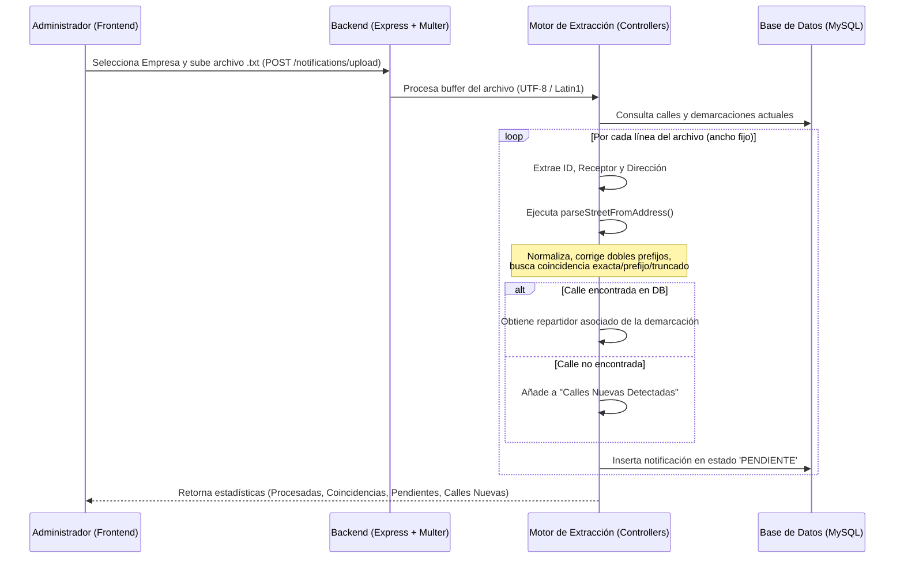

# Guía de Implementación en Producción - Trinitas

Esta guía detalla todos los pasos necesarios para desplegar los últimos cambios en el servidor de producción. Incluye cambios en la **base de datos**, el **backend** y el **frontend**.

---

## ⚠️ PASO 0 — Backup previo (OBLIGATORIO)

Antes de tocar nada en producción, haz un backup completo de la base de datos:

```bash
mysqldump -u [usuario] -p [nombre_base_de_datos] > backup_$(date +%Y%m%d_%H%M%S).sql
```

---

## PASO 1 — Actualizar el código

Conéctate al servidor y descarga los últimos cambios desde GitHub:

```bash
cd /ruta/al/proyecto
git pull origin main
```

---

## PASO 2 — Migraciones de Base de Datos

> ⚠️ **Ejecuta los scripts en este orden exacto.** Cada uno es idempotente (si la columna/tabla ya existe no fallará), pero el orden importa.

Desde la carpeta `backend/`:

```bash
cd backend
```

### 2a. Añadir columna `company` a `notifications` (si no existe)
```bash
node migrate_company.js
```

### 2b. Unificar IDs de notificaciones a nivel global
```bash
node make_id_unique.js
```
*Limpia duplicados y garantiza unicidad global del campo `id_notificacion`.*

### 2c. Sistema de Roles y Permisos
```bash
node migrate_roles_permissions.js
```
*Crea la tabla `user_permissions` y migra la columna `role` en `users` (valores: `ADMINISTRADOR`, `GERENTE`, `EMPLEADO`).*

### 2d. Columna de archivado en notificaciones
```bash
node add_is_archived_column.js
```
*Añade la columna `is_archived TINYINT(1) DEFAULT 0` a la tabla `notifications`.*

---

## PASO 3 — Instalar dependencias

```bash
# Backend
cd backend
npm install

# Frontend
cd ../frontend
npm install
```

---

## PASO 4 — Compilar el Frontend

```bash
cd frontend
npm run build
```

El resultado se generará en `frontend/dist/`. Asegúrate de que tu servidor web (Nginx/Apache) sirve este directorio para las rutas del frontend.

---

## PASO 5 — Reiniciar el Backend

```bash
# Si usas PM2:
pm2 restart all
pm2 save

# Si usas systemd:
sudo systemctl restart trinitas-backend
```

---

## PASO 6 — Verificación post-despliegue

Comprueba que todo funciona correctamente:

- [ ] Login con usuario **Administrador** → accede a todos los módulos
- [ ] Login con usuario **Gerente** → accede solo a los módulos permitidos
- [ ] Login con usuario **Empleado** → accede solo a notificaciones (si tiene permiso)
- [ ] En `/notifications`: la tabla se muestra correctamente en escritorio
- [ ] Exportar PDF filtrando por fecha → solo se archivan las notificaciones del filtro
- [ ] El checkbox "Mostrar archivadas" muestra **únicamente** las archivadas
- [ ] Gestión de usuarios: se puede cambiar contraseña desde el modal de edición

---

## Resumen de todos los cambios implementados

### 🔐 Sistema de Roles y Permisos (RBAC)
- Tres roles: **Administrador**, **Gerente**, **Empleado**
- Tabla `user_permissions` para asignar acceso módulo a módulo
- Middleware `requirePermission` en todas las rutas sensibles
- El menú lateral se adapta dinámicamente a los permisos del usuario

### 🔑 Gestión de Contraseñas
- El modal de edición de usuario permite cambiar la contraseña opcionalmente

### 📋 Listado de Notificaciones
- **Vista escritorio**: tabla compacta en lugar de tarjetas
- **Vista móvil**: tarjetas (sin cambios)
- **Filtro "Mostrar archivadas"**: muestra **solo** las archivadas (no mezcla con activas)
- **Exportación PDF**: corregido bug por el que se archivaban todas las notificaciones en lugar de solo las filtradas exportadas
- **Archivado al exportar**: flujo con SweetAlert — pregunta si archivar antes de generar el PDF

### 🗄️ Base de Datos
- Nueva columna `is_archived` en `notifications`
- Nueva tabla `user_permissions`
- Columna `role` en `users` con valores `ADMINISTRADOR` / `GERENTE` / `EMPLEADO`


---

# Análisis del Sistema de Carga de Notificaciones y Asignación

Este sistema permite procesar archivos de texto delimitados (ancho fijo) que contienen la información de notificaciones diarias, normalizar las direcciones para identificar la calle, y asignar automáticamente cada notificación al repartidor correspondiente según las demarcaciones definidas.

## 1. Arquitectura y Flujo de Datos



---

## 2. Detalles del Flujo y Procesamiento

### A. Frontend (`frontend/src/pages/UploadNotifications.jsx`)
- **Selección de Empresa**: El usuario debe seleccionar una de las dos empresas emisoras:
  - **Energía Ceuta XXI Comercializadora de Referencia, S.A.U.** (`ENERGIA_CEUTA`)
  - **Alumbrado Eléctrico de Ceuta Energía, S.L.** (`ALUMBRADO_CEUTA`)
- **Carga de Archivo**: Se permite arrastrar y soltar o seleccionar un archivo `.txt`.
- **Panel de Resultados**: Al completarse la subida, se renderizan:
  - **Tarjetas estadísticas**: Total procesadas, calle identificada, con repartidor, y pendientes de asignación manual.
  - **Panel de Calles Nuevas**: Si se detectan calles en el archivo de texto que no están registradas en el sistema, ofrece la opción de **Añadir Todas las Calles Nuevas** en bloque (`POST /notifications/add-streets`).
  - **Gestión Manual de Direcciones**: Para las notificaciones que no pudieron asignarse automáticamente a un repartidor:
    - **Aceptar Todas las Calles Detectadas**: Asigna masivamente las notificaciones cuyas calles ya fueron añadidas al sistema (`POST /notifications/bulk-assign`).
    - **Buscador Autocompletable**: Permite buscar y seleccionar una calle manualmente para cada notificación individual y guardarla (`POST /notifications/assign-manual`).

### B. Backend (`backend/controllers/notifications.controller.js`)
- **Ruta**: `POST /api/notifications/upload` gestionada por el middleware `multer.memoryStorage()`, restringida a usuarios autenticados con rol de administrador (`verifyToken`, `requireAdmin`).
- **Detección Inteligente de Codificación**: 
  - Si el contenido parseado a UTF-8 contiene caracteres inválidos (`\uFFFD`), cambia automáticamente a `latin1` para evitar problemas con tildes y caracteres especiales (por ejemplo, la `Ñ`).
- **Parsing de Ancho Fijo**:
  - Cada línea del archivo se procesa utilizando posiciones de caracteres específicas:
    - **ID Notificación**: Caracteres `0` al `5` (5 caracteres).
    - **Destinatario**: Caracteres `5` al `45` (40 caracteres).
    - **Dirección Completa**: Carácter `45` en adelante.

### C. Motor de Extracción de Calles (`parseStreetFromAddress`)
Para emparejar una dirección de texto libre con las calles de la base de datos, el backend aplica varias estrategias de forma secuencial:
1. **Separación por Espacios Dobles**: Si la dirección tiene dos espacios seguidos, intenta extraer la primera parte como el nombre de la calle.
2. **Normalización y Prefijos**: Convierte la dirección a mayúsculas y comprueba si comienza con algún tipo de calle estándar (`STREET_TYPES` como `CALLE`, `AVENIDA`, `BARRIADA`, `POLÍGONO`, `URBANIZACIÓN`, etc.).
3. **Limpieza de Dobles Prefijos**: Detecta y corrige errores comunes del archivo (por ejemplo, `"GRUPO GRUPO ALFAU"` se corrige a `"GRUPO ALFAU"`).
4. **Coincidencias en Base de Datos**:
   - **Coincidencia Exacta / Prefijo**: Compara el fragmento de dirección contra el listado de calles de la DB (ordenado de mayor a menor longitud para evitar falsos positivos con nombres más cortos contenidos en otros más largos).
   - **Coincidencia Truncada**: Si la dirección es larga (>= 25 caracteres), busca si coincide con el inicio de alguna calle registrada.
5. **Fallback por Regex**: Utiliza expresiones regulares para extraer fragmentos que continúen a los tipos de calle omitiendo números, portales, pisos o indicaciones de pisos (`ESC`, `PISO`, `PTL`, etc.).

---

## 3. Estructura de la Base de Datos Relacionada

- **`streets`**: Almacena el nombre único de la calle (`id`, `name`).
- **`demarcations`**: Define la relación entre una calle y el repartidor asignado (`id`, `user_id`, `street_id`).
- **`notifications`**: Contiene la información de la notificación y sus claves foráneas a la calle y al repartidor asignado:
  - `id_notificacion` (código de 5 dígitos).
  - `recipient_name` (destinatario).
  - `full_address` (dirección original completa).
  - `street_id` (referencia a la calle resuelta).
  - `assigned_user_id` (referencia al usuario repartidor asignado).
  - `status` (`PENDIENTE`, `1ER_INTENTO`, `ENTREGADA`, `DEVUELTA`, `FALLIDA`).
  - `company` (empresa emisora).

